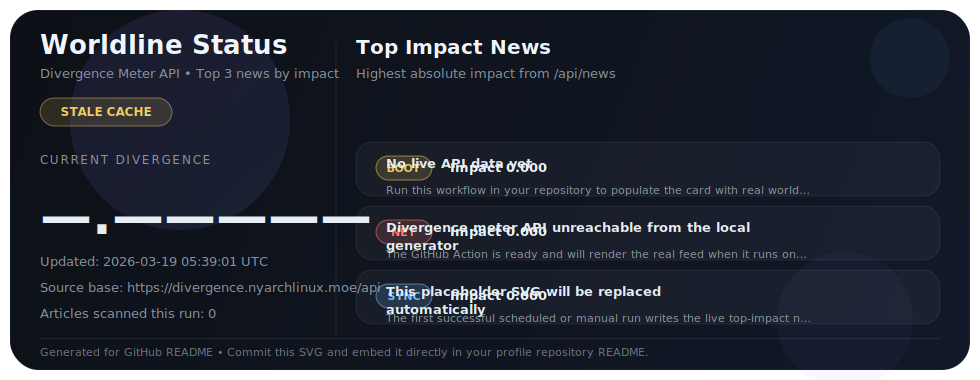

# README embed snippet

Add this to your GitHub profile repository `README.md` after you copy the files into the repo:

```md
<p align="center">
  
</p>
```

If you want to use the raw GitHub URL instead:

```md

```

Expected repo layout:

```text
.github/workflows/update-worldline-card.yml
scripts/generate-worldline-card.mjs
assets/worldline-card.svg
data/worldline.json
```
